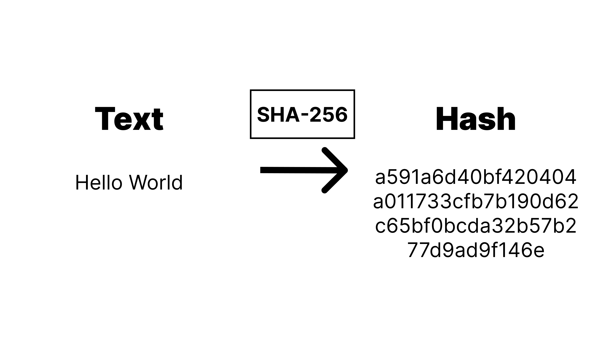
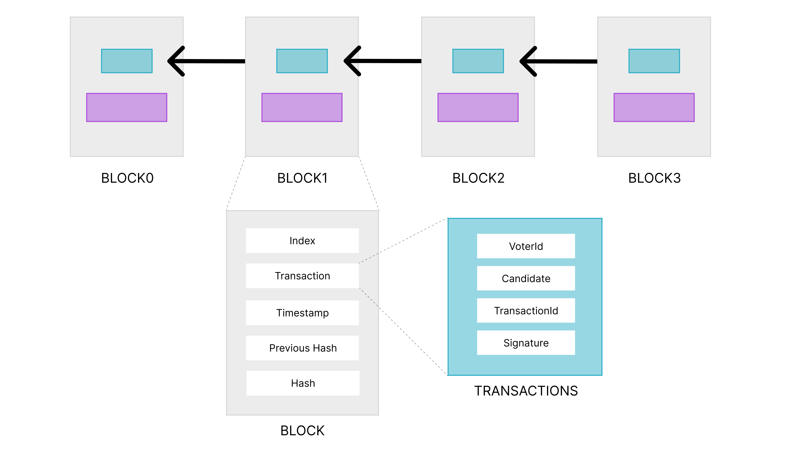

<div align="center">
    <h3>🗳️ 블록체인 기반 투표 시스템</h3>
    <h4>Voting System Based On BlockChain</h4>
</div>

---

<div align="center">
    <a href="https://opensource.org/licenses/MIT">
        
    </a>
    <br>
    
</div>

## Introduction 📌
2024년 12월 3일 22시 23분경 (KST) 대한민국의 제20대 대통령인 [윤석열](https://namu.wiki/w/%EC%9C%A4%EC%84%9D%EC%97%B4) 대통령은 대한민국 전역에 비상계엄을 선포했다. [참고 자료](https://www.nytimes.com/2024/12/03/world/asia/what-is-martial-law-south-korea.html)\
12월 3일 밤 10시 23분 경 긴급 브리핑을 연 윤석열 대통령은 종북과 반국가세력을 척결하고 자유대한민국을 수호하겠다는 명분으로 전국 단위의 비상계엄을 선포함에 따라 계엄사령부를 설치하고 [계엄군](https://namu.wiki/w/%EA%B3%84%EC%97%84?from=%EA%B3%84%EC%97%84%EA%B5%B0)을 동원했다.\
계엄군은 국회 및 선거관리위원회등을 공격했다. 계엄군은 국회에 투입된 병력과 버금가는 병력으로 각 지역의 선거관리위원회를 공격했으며, 이후 언론과의 인터뷰에서 [김용현](https://namu.wiki/w/%EA%B9%80%EC%9A%A9%ED%98%84) 전 국방장관이 [선관위 부정선거 의혹 수사가 필요한지 판단하기 위해서](https://namu.wiki/w/%EC%A0%9C21%EB%8C%80%20%EA%B5%AD%ED%9A%8C%EC%9D%98%EC%9B%90%20%EC%84%A0%EA%B1%B0/%EB%B6%80%EC%A0%95%EC%84%A0%EA%B1%B0%20%EC%9D%8C%EB%AA%A8%EB%A1%A0) 선거관리위원회에 계엄군을 진입시켰다고 언급했다.\
또한 [키르기스스탄](https://namu.wiki/w/%ED%82%A4%EB%A5%B4%EA%B8%B0%EC%8A%A4%EC%8A%A4%ED%83%84)에서도 2020년 10월 4일 총선에서 집권 여당이 승리를 거두었지만, 선거운동을 하는 가운데 유권자 매수가 심각하게 이루어졌다고 밝혀졌고 6일 키르기스스탄 중안선관위에서 [선거결과를 무효화하기로 결정했다.](https://www.hani.co.kr/arti/international/asiapacific/964799.html)\
이에 나는 블록체인 기술을 기반으로 투표권을 보호하여 투표를 한다면 부정선거를 줄일 수 있지 않을까라는 생각에 개발하게 되었다.

## Pros VS Cons 🥊
블록체인 기술 기반 투표도 장단점이 존재한다.
* 장점
    * 위, 변조할 수 없어 보안성과 투명성이 보장된다.
    * 장소, 시간등 물리적 한계 극복이 가능해 많은 사람들이 참여가 가능해진다.
* 단점
    * PC, 모바일 사용이 익숙하지 않거나 온라인 투표를 경험한 적 없는 사람은 투표 참여를 포기할 가능성이 있다.
    * 본인이 직접 투표했다는 사실을 증명하기 어렵다.

## Structure 📚
투표 내역은 [SHA-256](https://namu.wiki/w/SHA?from=SHA-256) 암호 알고리즘을 이용해 보호하였다.

각 [블록](./VotingModel/Block.py)들은 [투표 내역](./VotingModel/Transaction.py), 시간, 해쉬등을 포함하여 연결되었다.


## Getting Started 🚀
First, install all dependencies.
```bash
pip install -r requirements.txt
```
And, run [main.py](./main.py)
```bash
python3 main.py
```
